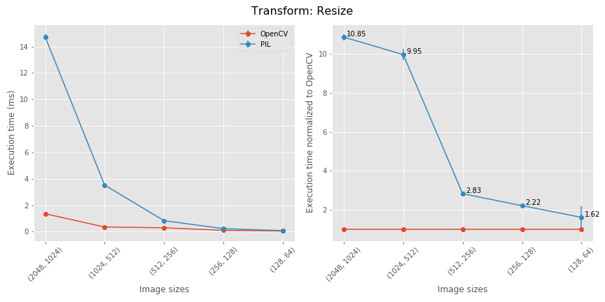
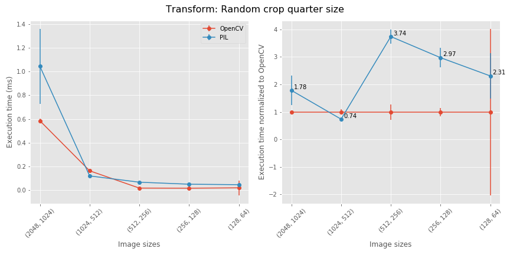
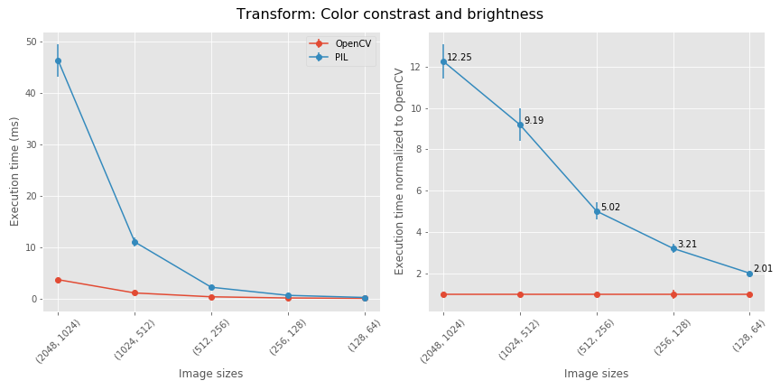
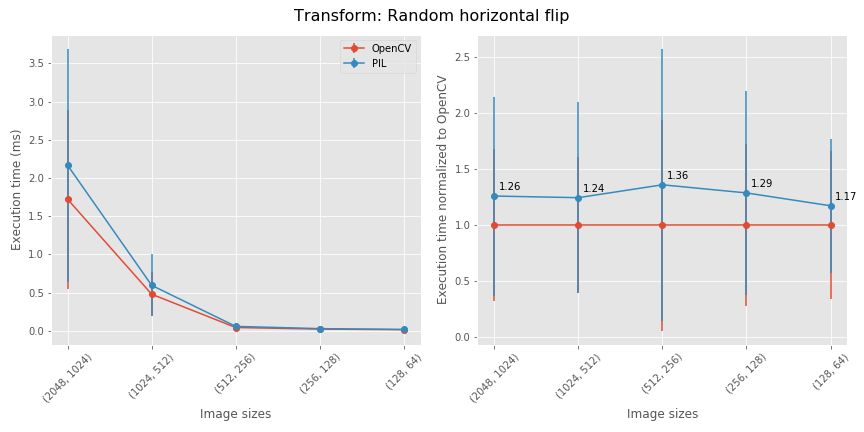

# opencv_transforms

This is intended as a faster drop-in replacement of Pytorch's Torchvision augmentations "transforms" [package](https://github.com/pytorch/vision/tree/master/torchvision/transforms), based on NumPy and OpenCV (PIL-free) for computer vision pipelines. 

This repository is the result of merging [jbohnslav](https://github.com/jbohnslav/opencv_transforms) and [YU-Zhiyang](https://github.com/YU-Zhiyang/opencv_transforms_torchvision) repositories which had the same purpose, and my own OpenCV-based augmentations from [BasicSR](https://github.com/victorca25/BasicSR), in order to allow to refactor the project's data flow and streamline to use the Torchvision's API as a standard. This enables changing or combining different base frameworks (OpenCV, Pillow/Pillow-SIMD, etc) only by modifying the imported library and also to easily switch to other replacements like [Kornia](https://github.com/kornia/kornia), [Albumentations](https://github.com/albumentations-team/albumentations), or [Rising](https://github.com/PhoenixDL/rising), based on the user's needs.

Most functions in Pytorch transforms are reimplemented, but there are some considerations:
   1) ToPILImage is not implemented, we use OpenCV instead (ToCVImage). However, the original ToPILImage in ~transforms can be used to save the tensor as a PIL image if required. Once transformed into tensor format, images have RGB channel order in both cases. 
   2) OpenCV images are Numpy arrays. OpencV supports uint8, int8, uint16, int16, int32, float32, float64. Certain operations (like `cv.CvtColor()`) do require to convert the arrays to OpenCV type (with `cv.fromarray()`).
   3) The affine transform in the original one only has 5 degrees of freedom, YU-Zhiyang implemented an Affine transform with 6
    degress of freedom called `RandomAffine6` (can be found in [transforms.py](opencv_transforms/transforms.py)). The
     original method `RandomAffine` is also available and reimplemented with OpenCV.
   4) The rotate function is clockwise, however the original one is anticlockwise.
   5) Some new augmentations have been added, in comparison to Torchvision's and are indicated in **Support** with and asterisk.
   6) **The outputs of the OpenCV versions are almost the same as the original one's (it's possible to test by running [test.py](/test.py)) directly with test images**.

## Support:
From the original Torchvision transforms:
* `Compose`, `ToTensor`, `ToCVImage`, `Normalize`,
* `Resize`, `CenterCrop`, `Pad`,
* `Lambda` (may not work well in multiprocess in Windows, YMMV),
* `RandomApply`, `RandomOrder`, `RandomChoice`, `RandomCrop`,
* `RandomHorizontalFlip`, `RandomVerticalFlip`, `RandomResizedCrop`,
* `FiveCrop`, `TenCrop`, `LinearTransformation`, `ColorJitter`,
* `RandomRotation`, `RandomAffine`, `*RandomAffine6`,
* `Grayscale`, `RandomGrayscale`, `RandomErasing`

New transforms:
* `*Cutout`, `*RandomPerspective`,
* `*RandomGaussianNoise`, `*RandomPoissonNoise`, `*RandomSPNoise`,
* `*RandomSpeckleNoise`, `*RandomJPEGNoise`, 
* `*RandomAverageBlur`, `*RandomBilateralBlur`, `*RandomBoxBlur`, `*RandomGaussianBlur`,
* `*BayerDitherNoise`, `*FSDitherNoise`, `*AverageBWDitherNoise`,`*BayerBWDitherNoise`,
* `*BinBWDitherNoise`,`*FSBWDitherNoise`,`*RandomBWDitherNoise`,
* `*FilterMaxRGB`,`*FilterColorBalance`,`*FilterUnsharp`,`*FilterCanny`


## Requirements
* python >=3.5.2
* numpy >=1.10 ('@' operator may not be overloaded before this version)
* pytorch>=0.4.1
* (torchvision>=0.2.1)
* A working installation of OpenCV. **Tested with OpenCV version 3.4.1, 4.1.0**
* Tested on Windows 10 and Ubuntu 18.04. There is evidence that OpenCV doesn't work well with multithreading on Linux / MacOS, for example `num_workers >0` in a pytorch `DataLoader`. jbohnslav hasn't run into this issue yet. 

## Usage
1) git clone https://github.com/victorca25/opencv_transforms_torchvision.git .
2) Add `cvtorchvision` to your python path.
3) Add `from opencv_transforms import transforms` in your python file.
4) From here, almost everything should work exactly as the original `transforms`.
#### Example: Image resizing 
   ```python
   import numpy as np
   image = np.random.randint(low=0, high=255, size=(1024, 2048, 3))
   resize = transforms.Resize(size=(256,256))
   image = resize(image)
   ```
Should be 1.5 to 10 times faster than PIL. See benchmarks

#### Example: Composing transformations

   ```
         transform = transforms.Compose([
            transforms.RandomAffine(degrees=10, translate=(0.1, 0.1), scale=(0.9, 1.1), shear=(-10, 0)),
            transforms.Resize(size=(350, 350), interpolation="BILINEAR"),
            transforms.ToTensor(),
            transforms.Normalize([0.485, 0.456, 0.406], [0.229, 0.224, 0.225]),
            ])
   ```

More examples can be found in the  official Pytorch [tutorials](https://pytorch.org/tutorials/beginner/transfer_learning_tutorial.html).

# Attention:
As tested by YU-Zhiyang, the multiprocessing used in dataloader of Pytorch may have issues with lambda function in Windows as lambda function can't be pickled (https://docs.python.org/3/library/pickle.html#what-can-be-pickled-and-unpickled).

So the Lambda in [transforms.py](torchvision/transforms/transforms.py) may not work properly in Windows.

## Performance
The following are the performance tests as executed by jbohnslav. 
* Most transformations are between 1.5X and ~4X faster in OpenCV. Large image resizes are up to 10 times faster in OpenCV.
* To reproduce the following benchmarks, download the [Cityscapes dataset](https://www.cityscapes-dataset.com/). 
* An example benchmarking file that jbohnslav used can be found in the notebook **benchmarking_v2.ipynb** where the Cityscapes default directories are wrapped with a HDF5 file for even faster reading (Note: this file has not been updated or tested for a very long time, but can serve as a reference).








The changes start to add up when you compose multiple transformations together.


Compared to regular Pillow, cv2 is around three times faster than PIL, as shown in this [article](https://www.kaggle.com/vfdev5/pil-vs-opencv).

Additionally, the [Albumentations project](https://github.com/albumentations-team/albumentations), mostly based on Numpy and OpenCV also has shown better performance than other options, including torchvision with a fast Pillow-SIMD backend.

But it can also be the case that Pillow-SIMD can be faster in some cases, as tested in this [article](https://python-pillow.org/pillow-perf/)

## Alternatives
There are multiple image augmentation and manipulation frameworks available, each with its own strengths and limitations. Some of these alternatives are:
* [Torchvision](https://github.com/pytorch/vision): Based on [Pillow (default)](https://python-pillow.org/), [Pillow-SIMD](https://github.com/uploadcare/pillow-simd), [accimage](https://github.com/pytorch/accimage), [libpng](http://www.libpng.org/pub/png/libpng.html), [libjpeg](http://ijg.org/) or [libjpeg-turbo](https://libjpeg-turbo.org/)
* [Kornia](https://github.com/kornia/kornia): Inspired by OpenCV, for differentiable tensor image functions
* [Albumentations](https://github.com/albumentations-team/albumentations): Based on pure NumPy, [OpenCV](https://github.com/opencv/opencv) and [imgaug](https://github.com/aleju/imgaug), with a large variety of transformations
* [Rising](https://github.com/PhoenixDL/rising): For differentiable 2D and 3D image functions
* [TorchIO](https://github.com/fepegar/torchio): For 3D medical imaging


# Postscript
* Part of the intention of this merge between jbohnslav's and YU-Zhiyang's projects was to bugfix and allow the authors to more easily incorporate the changes back themselves if they are useful and also to allow to decouple the augmentations code from BasicSR, so it's easier to add more augmentations or even change the backend like in DinJerr's [fork](https://github.com/DinJerr/BasicSR), based on [wand](https://github.com/emcconville/wand)+[ImageMagick](https://imagemagick.org/).
* Each backend has it's pros and cons, but important points to consider when choosing are: available augmentation types, performance, external dependencies, features (for example, Kornia's differentiable augmentations) and user preference (all previous points being equal).